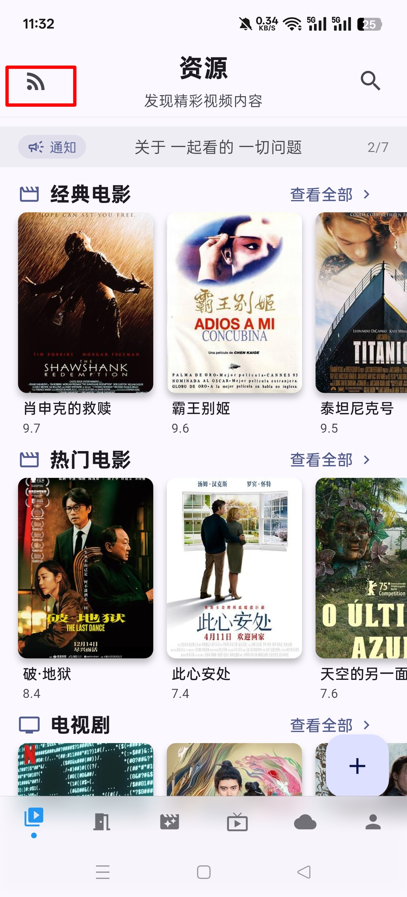

# 导入视频源

"一起看"应用支持添加CMS视频源，本文档提供了一些推荐的视频源配置，您可以直接复制添加到应用中。

## 方式一：URL导入
1. 打开应用中的「订阅源管理」界面


{width=200}

{width=200}

2. 点击「输入URL」选项

{width=200}

3. 粘贴以下订阅源地址：[https://togother.pwxiao.top/assets/source.json](https://togother.pwxiao.top/assets/source.json)
4. 点击「导入」按钮完成操作

---

## 方式二：手动粘贴JSON
1. 点击「粘贴JSON」选项

{width=200}

2. 复制以下完整JSON配置：

```json
[
  {
    "name": "速播",
    "url": "https://subocaiji.com/api.php/provide/vod/at/json",
    "enabled": true,
    "use_proxy": true
  },
  {
    "name": "无尽",
    "url": "https://api.wujinapi.me/api.php/provide/vod/from/wjm3u8/at/json/",
    "enabled": true,
    "use_proxy": true
  },
  {
    "name": "天空",
    "url": "http://api.tiankongapi.com/api.php/provide/vod/at/json",
    "enabled": true,
    "use_proxy": true
  },
  {
    "name": "卧龙",
    "url": "https://collect.wolongzyw.com/api.php/provide/vod/at/json",
    "enabled": true,
    "use_proxy": true
  },
  {
    "name": "ikun",
    "url": "https://ikunzyapi.com/api.php/provide/vod/",
    "enabled": true,
    "use_proxy": false
  },
  {
    "name": "四圈",
    "url": "https://pg.fenwe078.cf/api.php/provide/vod/",
    "enabled": true,
    "use_proxy": true
  },
  {
    "name": "360",
    "url": "https://360zy.com/api.php/provide/vod",
    "enabled": true,
    "use_proxy": true
  },
  {
    "name": "非凡",
    "url": "http://cj.ffzyapi.com/api.php/provide/vod/at/json/",
    "enabled": true,
    "use_proxy": true
  },
  {
    "name": "最大",
    "url": "https://api.zuidapi.com/api.php/provide/vod/from/zuidam3u8/",
    "enabled": true,
    "use_proxy": true
  },
  {
    "name": "暴风",
    "url": "https://bfzyapi.com/api.php/provide/vod/",
    "enabled": true,
    "use_proxy": true
  },
  {
    "name": "极速",
    "url": "https://jszyapi.com/api.php/provide/vod/from/jsm3u8/at/json",
    "enabled": true,
    "use_proxy": true
  },
  {
    "name": "量子",
    "url": "https://cj.lziapi.com/api.php/provide/vod/from/lzm3u8/",
    "enabled": true,
    "use_proxy": true
  },
  {
    "name": "B",
    "url": "https://json02.heimuer.xyz/api.php/provide/vod/",
    "enabled": true,
    "use_proxy": true
  },
  {
    "name": "豆瓣",
    "url": "https://caiji.dbzy5.com/api.php/provide/vod/from/dbm3u8/at/josn/",
    "enabled": true,
    "use_proxy": true
  }
]
```

3. 点击「导入」按钮完成操作


<div style="text-align: center; padding: 10px; margin: 10px 0; background-color: #f5f5f5; border-radius: 5px;">
  <script async src="//busuanzi.ibruce.info/busuanzi/2.3/busuanzi.pure.mini.js"></script>
  <span id="busuanzi_container_site_pv" style="font-size: 14px; color: #666;">
    本站总访问量 <span id="busuanzi_value_site_pv" style="font-weight: bold; color: #1976D2;"></span> 次
  </span>
</div>

